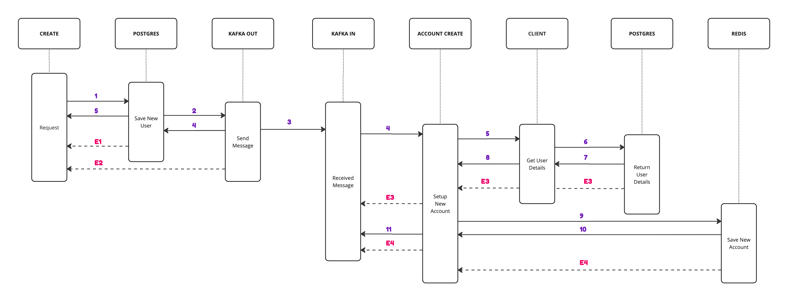

# Vanir

A project demonstrating 2 applications using WebFlux to asynchronously communicate with each other.

# Architecture

[Miro board](https://miro.com/app/board/uXjVMIltjBI=/?share_link_id=997779665756)

# Running the project

## Start up docker containers (Production like)

There are shell scripts in `./scripts` that will build and run the docker containers for you.
There are IntelliJ run configurations for these scripts in the `.run` directory.

To run both apps on a docker network, run the following command in the root directory of the project:

### With logs
```shell
docker compose up -f docker-compose.branch.yml
```

```shell
docker compose down -f docker-compose.branch.yml
```
   
### Without logs
```shell
docker compose up -f docker-compose.branch.yml -d
```

```shell
docker compose down -f docker-compose.branch.yml -d
```

---

## Start up docker containers (Freya)

Navigate to the project directory and run `docker compose up`. 
Otherwise you can use the following commands:

### Without app
```shell
docker compose up -f ./freya/docker-compose.yml
```

```shell
docker compose down -f ./freya/docker-compose.yml
```

### With app
```shell
docker compose up -f ./freya/docker-compose.branch.yml
```

# 

```shell
docker compose down -f ./freya/docker-compose.branch.yml
```

---

## Start up docker containers (Freyr)

Navigate to the project directory and run `docker compose up`.
Otherwise you can use the following commands:

### Without app
```shell
docker compose up -f ./freyr/docker-compose.yml
```

```shell
docker compose down -f ./freyr/docker-compose.yml
```

### With app
```shell
docker compose up -f ./freyr/docker-compose.branch.yml
```

```shell
docker compose down -f ./freyr/docker-compose.branch.yml
```

## Postman

Once this is finalized, I will add postman config under the folder `/postman`

[](https://app.getpostman.com/run-collection/28838110-14ac1ab2-4872-4b23-a278-cf6c35bacccd?action=collection%2Ffork&source=rip_markdown&collection-url=entityId%3D28838110-14ac1ab2-4872-4b23-a278-cf6c35bacccd%26entityType%3Dcollection%26workspaceId%3Db1331932-913f-4060-8ebd-9046f2f99311)

## TODO

Flow - Endpoint to call to reserve a book for 

### All
* [ ] Docker Kafka (network)
* [ ] E2E testing with both services

### Freya
* [x] Docker Postgres
* [x] Postgres DB Setup
* [x] Endpoint
* [x] Docker Kafka (individual)
* [x] Kafka Consumer (Order)
* [x] Kafka Producer (User)
* [x] Setup Book
* [x] Setup Library (UserBooks)

### Freyr
* [x] Docker Redis
* [x] Endpoint
* [x] Docker Kafka (individual)
* [x] Kafka Consumer (User)
* [x] Kafka Producer (Order)

## Design



## References

- [Spring WebFlux](https://docs.spring.io/spring-framework/docs/current/reference/html/web-reactive.html#webflux)
- [Spring WebFlux - Testing](https://docs.spring.io/spring-framework/docs/current/reference/html/testing.html#webtestclient)
- [Spring WebFlux - WebClient](https://docs.spring.io/spring-framework/docs/current/reference/html/web-reactive.html#webflux-client)
- [Spring WebFlux - WebClient - Testing](https://docs.spring.io/spring-framework/docs/current/reference/html/testing.html#webtestclient)
- [Kotlin Coroutines](https://kotlinlang.org/docs/coroutines-overview.html)
- [Kotlin Coroutines - Testing](https://kotlinlang.org/docs/coroutines-testing.html)
- [Kotlin Coroutines - Flow](https://kotlinlang.org/docs/flow.html)
- [Kotlin Coroutines - Flow - Testing](https://kotlin.github.io/kotlinx.coroutines/kotlinx-coroutines-test/kotlinx.coroutines.flow/-flow-test/)
- [Kotlin R2DBC Example 1](https://github.com/helderlinhares/webflux-r2dbc-postgres-crud-api)
- [Kotlin R2DBC Example 2](https://github.com/Baeldung/kotlin-tutorials/blob/master/spring-boot-kotlin/src/main/kotlin/com/baeldung/nonblockingcoroutines/repository/ProductRepositoryCoroutines.kt)
- [Gradle + Docker Compose](https://github.com/avast/gradle-docker-compose-plugin)